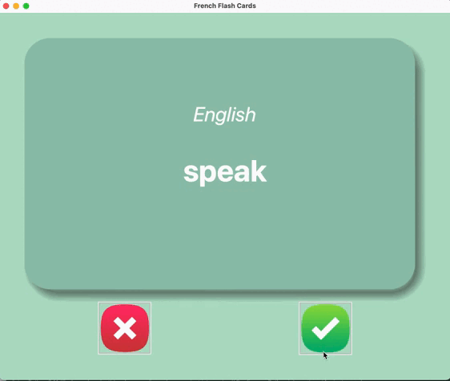

# French Flashcard App

## Demo

## Overview
This Flashcard App is a simple desktop application built using the Tkinter library in Python GUI. It is designed to 
help users learn and practice common French vocabulary using flashcards.

## Features
1. Flashcard Display: Users can view French words on one side of the flashcards and their English translations on the
other side.
2. Correct Button: Users can click on this button to let the computer know that they know the translation of the French 
word, so it can skip to the next French word without showing the English translation of the previous French word.
3. Wrong Button: Users can click on this button to let the computer know they do not know the translation of the word. 
It then shows the translation after 3 seconds
4. It has a csv file that contains common french vocabulary
5. It has a file were it stores the French words in a csv file the user got correctly in order to not repeat that word.

## Getting Started
### Requirements
1. Python installed on your computer
2. Tkinter library comes pre-installed with most python packages.

### Installation and Usage
1. Clone or download this repository.
2. Navigate to the project directory in your terminal "
3. Run the app using the "main.py" file or command
4. The app window will open, displaying the flashcard. Click on th correct button if you know the translation or click
on the wrong button if you do not know the translation.